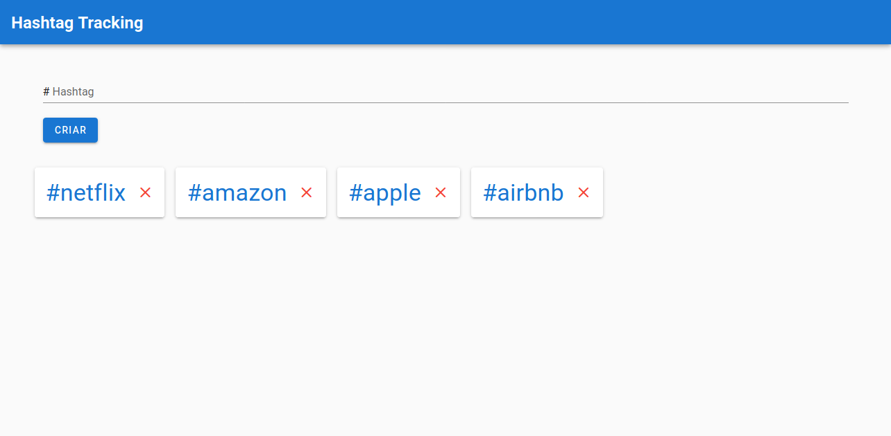

[](https://github.com/rafaelmatsumoto/hashtag-tracking)
[](https://github.com/rafaelmatsumoto/hashtag-tracking/issues)


<br />
<p align="center">

  <h3 align="center">Tracker de hashtags</h3>

  <p align="center">
    Client construído para cadastro e rastreio de hashtags
    <br />
    <br />
    <a href="https://hashtags-tracker-client.firebaseapp.com/#/">Demo</a>
  </p>
</p>


## Conteúdo

- [Conteúdo](#conte%c3%bado)
- [Sobre o projeto](#sobre-o-projeto)
- [Getting Started](#getting-started)
  - [Pré-requisitos](#pr%c3%a9-requisitos)
  - [Instalação](#instala%c3%a7%c3%a3o)
- [Uso](#uso)
- [Licença](#licen%c3%a7a)
- [Contato](#contato)


## Sobre o projeto



Client construído para cadastro e rastreio de hashtags, desenvolvido para o teste da Magrathea Labs.

## Getting Started

Instruções para rodar o projeto localmente

### Pré-requisitos

* Yarn: https://yarnpkg.com/en/docs/install

### Instalação
 
1. Clonar o repositório
```sh
git clone https://github.com/rafaelmatsumoto/hashtag-tracking-client
```

2. Project setup
```
yarn install
```

3. Compilar e levantar servidor de desenvolvimento
```
yarn serve
```

4. Compilar para a produção
```
yarn build
```

5. Rodar testes unitários
```
yarn test:unit
```

6. Lint
```
yarn lint
```

## Uso

Acessar o endereço

```sh
localhost:8080/#/
```

## Licença

Licença MIT. Consultar `LICENSE` para mais informações.

## Contato

Rafael Matsumoto - rafaelmatsumoto43@gmail.com

Projeto: [https://github.com/rafaelmatsumoto/hashtag-tracking](https://github.com/rafaelmatsumoto/hashtag-tracking)